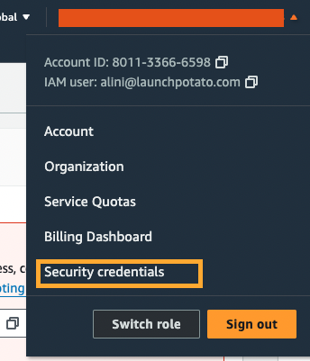

# li-aws-helper

Project to facilitate using aws resources

To start using this project, you must install our package: 

```
pip3 install -r li-aws-helper
```

And configurate your aws credentials just once:
```bash
li config
```

The service will make three questions for you:
- Access Key
- Secret Key
- MFA Identifier

All those answers you can find at AWS Console/ Security credentials 


  


## Package Usage for aws commands
- First we must configure your aws credentials:
```bash
li config
```

Then use as commandline to refresh your 2f auth with aws. 
```bash
li refresh --token xxxxxx
```

Install
```
pip3 install -r li-aws-helper
```


## Local Development

- Build the project: `poetry build`
- Install the project: `poetry install`
- install twine: `python3 -m pip install --upgrade twine`


FAQ
- What is a arn?
- Where I can find my AWS key and secret?


